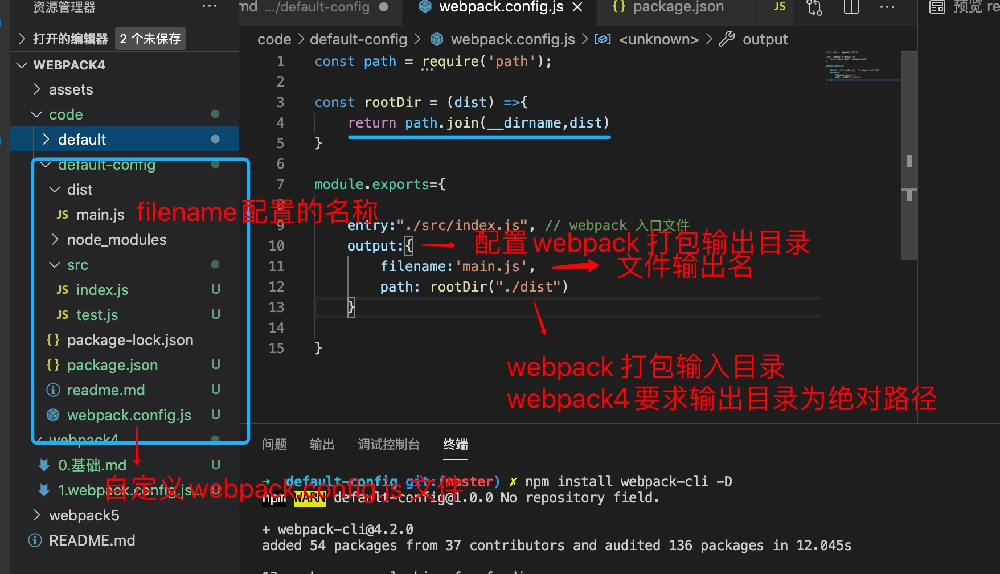

1. 创建项目

        npm init -y // 初始化package.json

2. 安装webpack

        npm install webpack webpack-cli -D

3. 在根目录下创建webpack.config.js 

        touch webpack.config.js

4. 配置webpack.config.js 

   

5. 执行webpack 

        npx webpack 

        会自动查找根目录下的webpack.config.js 文件