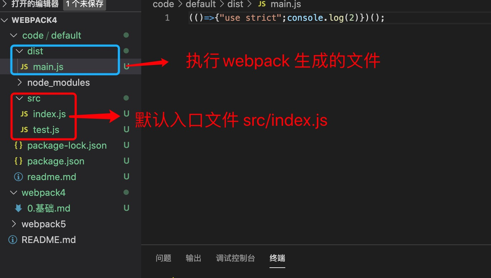
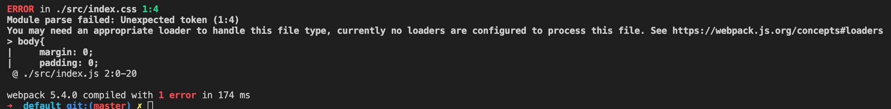

1. 默认使用webpack4 的配置

2. webpack4 默认入口文件为 src/dist ， 输出目录为dist

3. 初始化package.json 

        npm init -y

4. 安装webpack 

        npm install webpack webpack-cli -D

5. 建立src 目录

        test.js 

        export  const a=2;

        index.js 

        import {a} from './test'

6. 执行webpack 编译

        npx webpack
    
    

7. 默认webpack 只能打包js 文件，比如我们加入一个css

        index.css
          
        body{
            margin:0;
        }

        index.js 

        import './index.css'

        执行webpack

   

