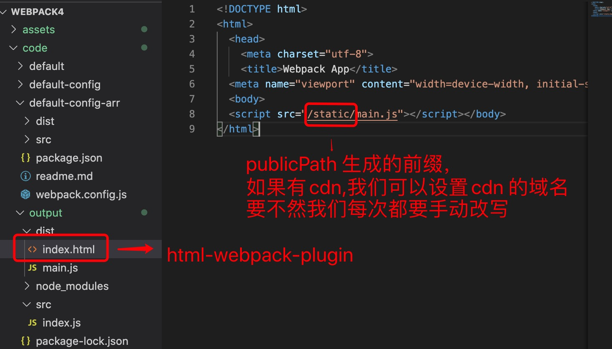
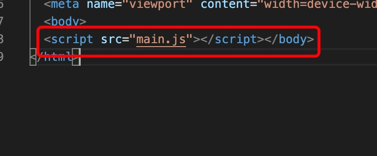

1. 创建package.json

        npm init -y

2. 安装webpack webpack-cli html-webpack-plugin

        npm install webpack webpack-cli -D

        npm install html-webpack-plugin -D

3. 创建webpack.config.js 文件

        touch webpack.config.js

4. 配置webpack

> 配置publicPath

        module.exports = {
            entry:"./src/index.js",
            output:{
                filename:"main.js",
                path:rootDir('./dist'),
                publicPath:"/static"
            },
            mode:"development",
            plugins:[
                new HtmlWebpackPlugin()
            ]
        }

   生成的文件如下图:

   

> 不带publicPath 生成的文件

        const path = require('path');

        const HtmlWebpackPlugin = require('html-webpack-plugin')

        const rootDir = dir =>{
            return path.join(__dirname,dir)
        }

        module.exports = {
            entry:"./src/index.js",
            output:{
                filename:"main.js",
                path:rootDir('./dist')
            },
            mode:"development",
            plugins:[
                new HtmlWebpackPlugin()
            ]
        }
    
   生成的文件如下图:

   