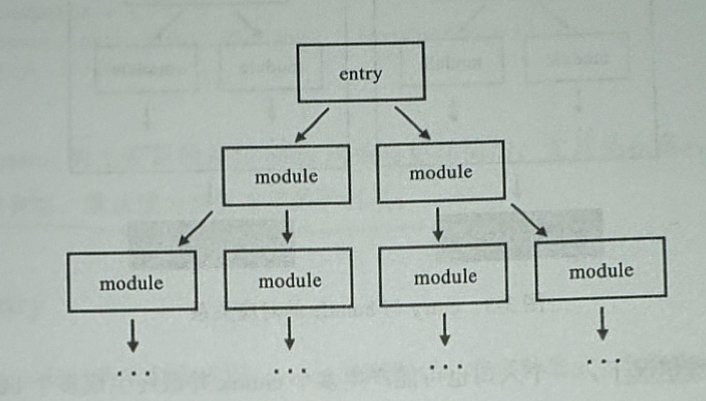

1. webpack.config.js 中entry 是webpack的入口文件配置，webpack 会根据配置的入口文件构建文件依赖树，然后打包文件

   ***entry 是文件的入口，因此是必须的***

   entry 告诉webapck 从哪个文件开始打包。

   

2. entry 的三种模式

> 字符串形式

        module.exports ={
            entry:"./src/index.js" // 入口文件为 根目录下src/index.js 文件
        }

   字符串形式打包的文件都会在一个js 文件中，比如输出js 文件为dist/main.js 文件

## 缺点：

   所有的文件都在一个js 文件中，那么随着项目的增大，相应的js 文件也越来越大， 由可能只有一个js 文件几M 甚至几十M（兆） 的情况，那么加载文件也就越来越慢，导致影响页面的夹杂速度，相应的页面白屏时间加长。

> 数组形式

        module.exports = {
            entry:["./src/index.js","./main.js"]
        }

   数组形式适用于index.js 文件找不到main.js 文件的入口

   ***数组形式最终打包文件还是打包到一个文件中。***