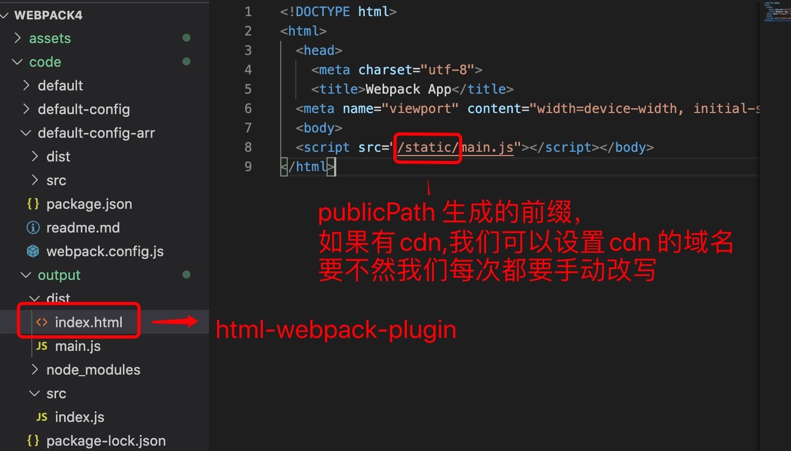
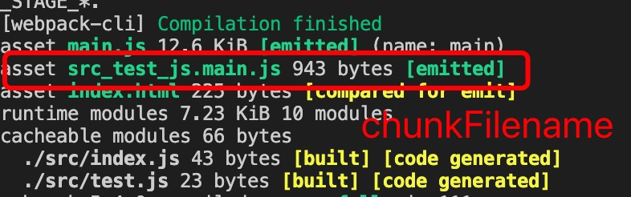

1. output 是webpack 打包完以后资源的输出配置，包括文件名称，文件存放路径，前缀，chunkName 等

        module.exports ={
            entry:"./src/index.js"， // 入口文件
            output:{
                filename:'main.js', // 打包以后文件的名称
                path:path.join(__dirname,"./dist")// 文件存放的路径，webpack4 以后要求必须为绝对路径
            }
        }

2. output 参数配置说明

> filename: 打包好文件以后文件的名称

   

   + 对于entry 是字符串或数组的的可以使用固定的文件名

            output:{
                filename: "main.js"
            }
   + 对于entry 是对象的，我们要使用占位符，为每个键值分发名称

            output :{
                filename:"[name].js"
            }
    
   + chunkhash 值根据文件内容生成hash ,内容不变hash 值不变，避免js上线时缓存出现的问题

            output :{
                filename: "[name].[chunkhash].js"
            }

> path: 打包好以后文件存储的目录

   

> publicPath: 文件配合html-webpack-plugin 生成文件的前缀

   publicPath 指定htmL-webpack-plugin 生成html 文件中script 标签引用的前缀，当我们要使用cdn 是，这一点尤为重要，不然每次我们都要自己去修改，如果忘记了会导致线上环境不能使用

   

   我们来看看没有设置publicPath 的输出如下图：

   

> chunkFilename:  异步生成js 的文件名称,因为我们把所有的文件生成到一个js 文件中，当项目增大时，js 文件也会越来越大。 因此会借助异步加载实现按需加载，提高页面首屏加载速度。

   而使用异步加载（import() 函数) 会生成小的chunk,因此我们需要为他们生成名称，默认使用Id,我们使用 id+ chunkhash 来避免再次上线时因缓存而导致的页面错误

        output:{
            filename:'main.js', // 同步生成的文件名
            path:path.join(__dirname,"./dist"), // 文件生成路径
            chunkFilename:"[id].[chunkhash].js"
        }

   + 实例

         test.js

         console.log("import()");

         index.js

         import("./test") // webpack 最新使用import() 实现异步加载
         console.log("index");
        
   webpack 默认使用id.js 来标识生成的文件名

   

        配置chunkFilename

        output :{
            filename:"main.js", // 同步生成的js 名称
            path:path.join(__dirname,'./dist'), // 存放路径
            chunkFilename:"[id].[chunkhash].js" // 生成的chunk 的名称
        }

   
  
> library 和 libraryTarget 来决定我们怎样公开文件，比如：

        output: {
            library: "MyLibrary", // 定义库名为Mylibrary
            libraryTarget: "amd" // 生成amd 格式的js 文件
        }

