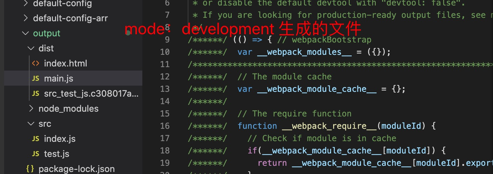

1. webpack4 新增了开发模式，分为development 和 production 和 none 三种模式

   webpack4 根据 mode  环境不同做了不同的优化，比如development 打包的js 文件不会压缩，但是production 环境会压缩

   webpack4 production 会自动开启 tree shaking (只支持es6 语法的导入)

2. 因此我们在开发时，可以根据不同的环境开启mode ,尤其是production 中还有很多优化

> mode 为development 生成的文件

   

> mode 为production 生成的文件

   

3. mode 如果不设置，默认为production,

   