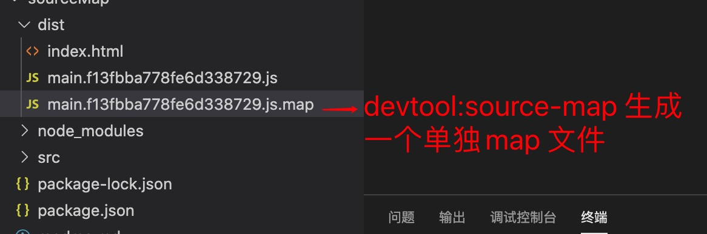
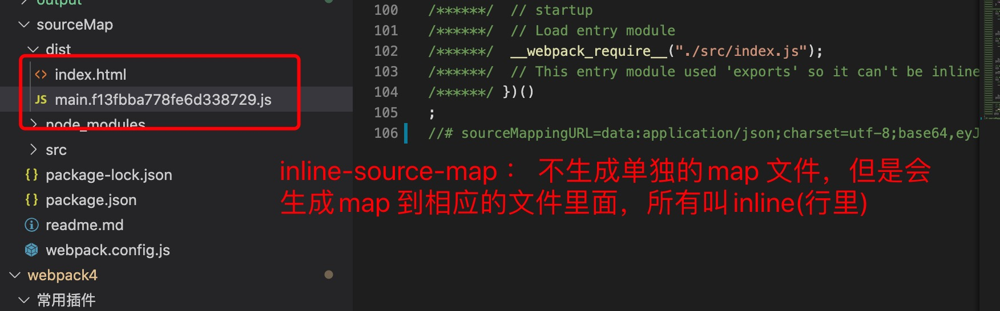

1.  sourceMap 是生成文件和项目文件的映射，方便与我们在浏览器中测试和跟踪bug.

   如果不设置sourceMap ，那么浏览器爆出的错误问题是生成的js 文件里面，如果js 文件压缩了，我们就更不好找

   因此我们就需要设置sourceMap ，可以方便我们在浏览器中跟踪到项目中的代码.

2. 开启sourceMap 很简单，只要设置devtools 即可

        module.exports ={
            entry:"./src/index.js",
            output:{
                filename:'main.js',
                path:path.join(__dirname,'./dist')
            },
            module:{
                rules:[
                    {
                        test:/\.js$/,
                        loader:'babel-loader'
                    }
                ]
            },
            mode:development,// 开发环境,
            devtool:'source-map' // 开始source-map
        }

3. devtool:source-map 可以使用的值和区别

> 生成单独的map 文件

   

+ cheap-module-source-map:

> 不生成单独的文件，使用内嵌的方法到生成的js 文件里面 

+ source-map : 生成一个单独的map 文件

  
+ inline-source-map : 不生成单独的map 文件,把sourceMap 文件放到js 文件里面

   

+ cheap-source-map: 会生成一个单独的source map 文件，但是和source map 不同的是，cleap 只是提供错误到行级别，不会提示那列错误

+ inline-cheap-source-map: 不生成单独的map 文件，

+ 