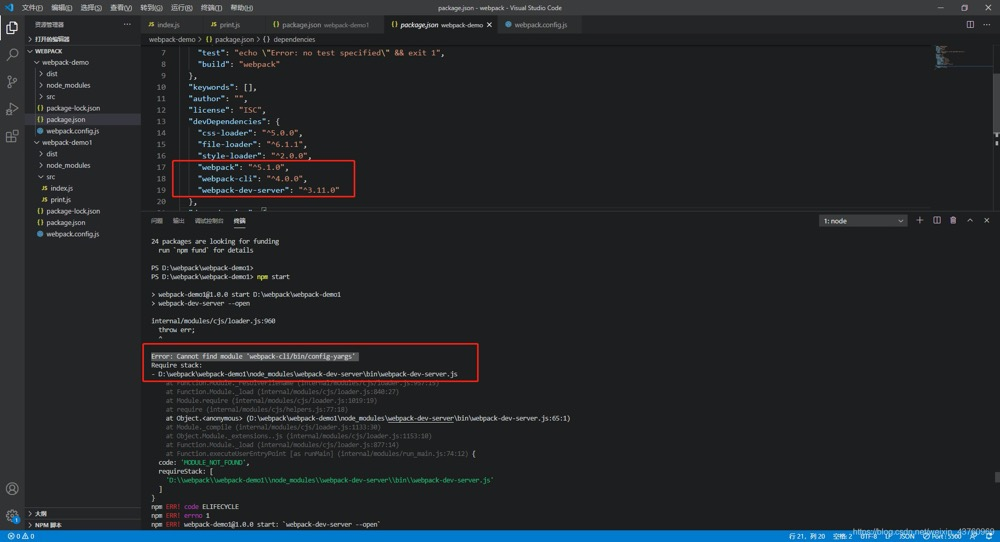

1. webpack-dev-server 是开发环境的一个代理服务器，不用老是编译以后才能查看，省去不少开发时间。

   webpack-dev-server 最主要的一下就是服务代理，避免ajax 跨域

   配置开发环境运行的环境，比如IP 地址，port 端口号等

   “script"{
       "dev":"webpack-dev-server --config webpack.config.js"
       // 启动使用webpack-dev-server
   }

   现在webpack 版本为5，因此dev-server 可能出现以下问题

   

   版本对应不上

2. 安装webpack -dev-server 

        npm install webpack-dev-server -D

        因为只有开发环境用到，因此我们安装到devDependencies（开发依赖选项） 中

3. 在webpack.config.js 中devServer 选项配置

> 配置实例代码

        const path = require('path');

        const rootDir = (dist) => {
            return path.join(__dirname,dist);
        } 

        module.exports = {
            entry:"./src/index.js",
            output:{
                filename:"main.js",
                path: rootDir("./dist")
            },
            // 开发环境devServer 配置
            devServer: {
                publicPath: ‘/static' // 和output 中publicPath 一样
            }
        }
        // publicPath 生成的文件前缀

        

        此处的static 就是publicPath ，我们可以用来指定cdn 的地址

> 配置参数说明

+ publicPath : 和 output 中一样

+ host:  主机

+ port : 端口号  默认端口号为8080

+ hot: true //  是否开启热更新，需要搭配HotReplacementPlugin 插件

        plugins:[
            new webpack.HotReplacementPlugin()
        ]

+ hotOnly: true: 页面不熟悉，比如修改样式

+ proxy: 代理，ajax 跨域

        proxy: {
           "/api": "http://localhost:3000"
        }

        proxy: {
            "/api": {
                target: "http://localhost:3000",
                pathRewrite: {"^/api" : ""}
            }
        }

4. webpack-dev-server 和 webpack build 生成的最大区别就是 webpack-dev-server 只是将打包结果放到内存中，并不生成实际文件。 每次接收到请求将内存中打包结果返回给浏览器。

   webpack  build 是生成实际的文件到dist 目录中

5. webpack-dev-server 另外最重要的一个功能就是自动刷新浏览器。 webpack 保存文件会自动编译然后自动刷新浏览器