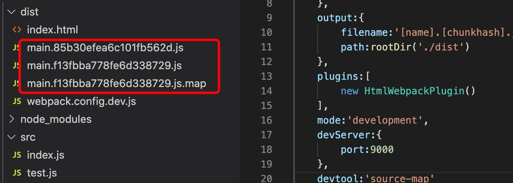
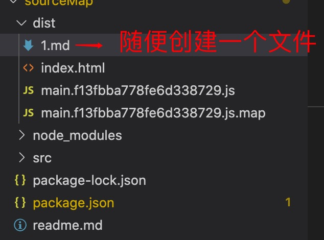
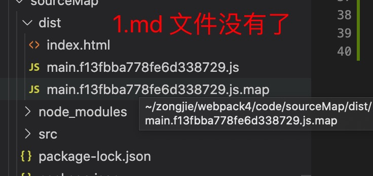

1. clean-webpack-plugin : 是清除打包文件，不然每次都生成会有垃圾文件在里面。

如果没有clean-webpack-plugin 每次生成dist 中的文件每次都在增多，会产生很多垃圾文件，因此每次都先清除上一次生成的文件

2. 安装clean-webpack-plugin 

        npm i clean-webpack-plugin -D

        或者

        npm install --save-dev clean-webpack-plugin

3. clean-webpack-plugin 会自动清除output 里面配置的path 目录中的文件

        const {CleanWebpackPlugin} = require('clean-webpack-plugin')

        const path = require('path')

        module.exports = {
            entry:"./src/index.js",
            output:{
                filename:'main.js',
                path:paht.join(__dirname,'./dist')
            },
            mode:'development',
            plugins:[
                new CleanWebpackPlugin()
            ]
        }

4. 验证是否删除

   在dist 文件夹中随便创建一个文件，比如1.md, 
   
   
   然后我们执行打包,发现1.md 文件被删除了

   